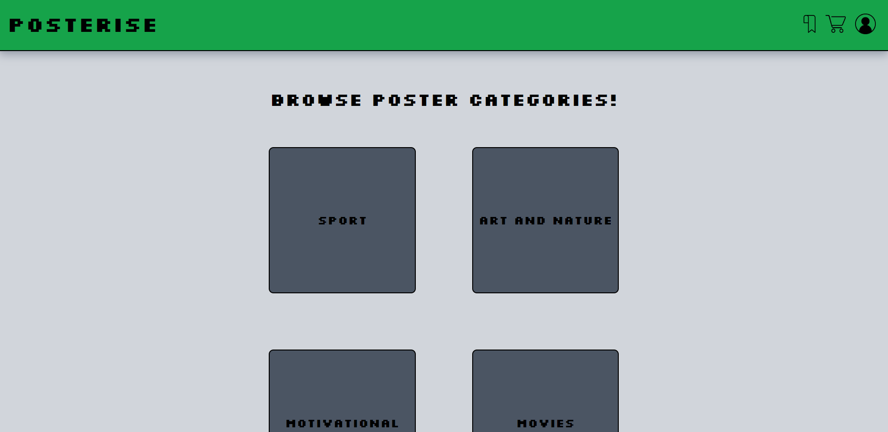
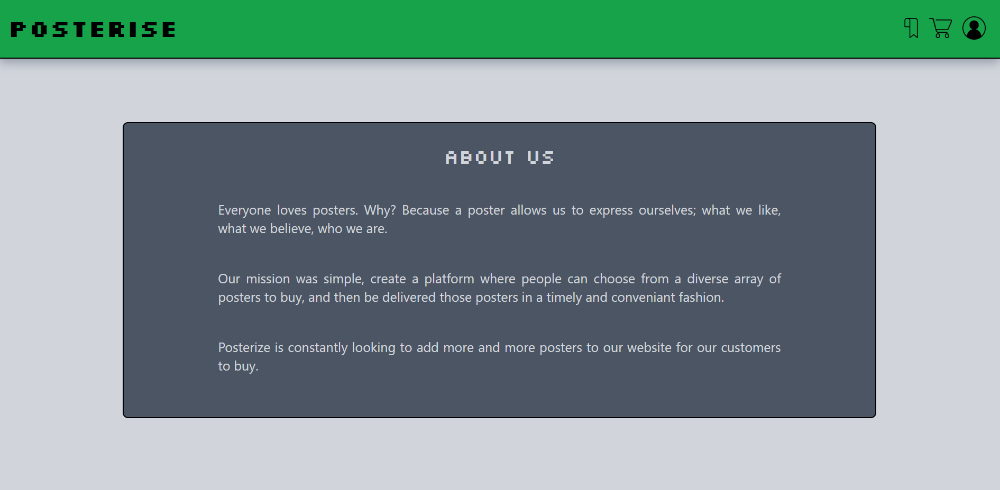
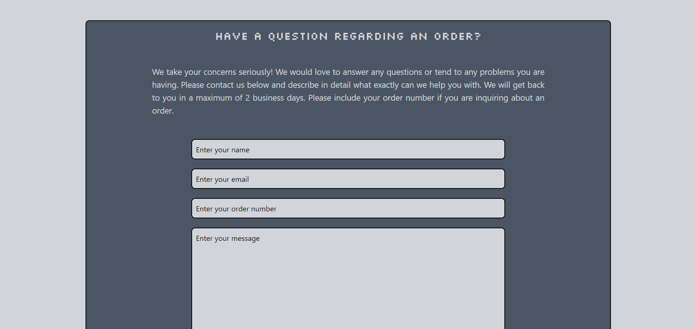
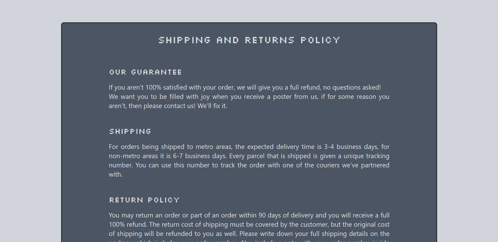
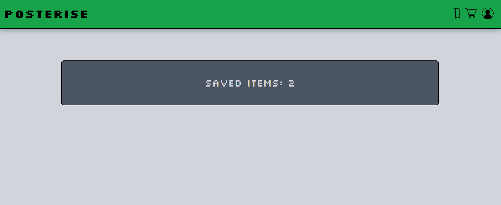
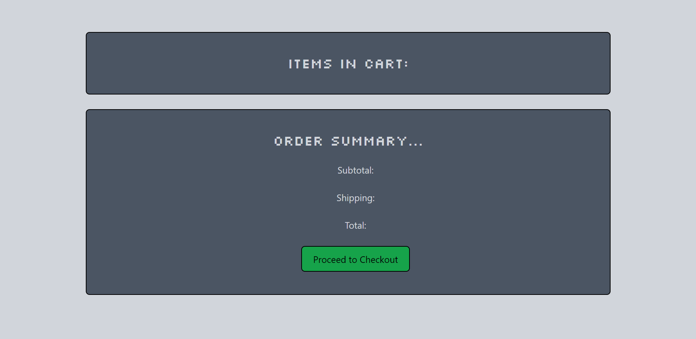
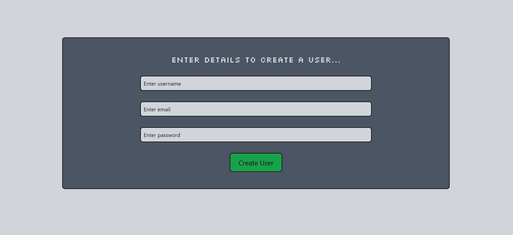
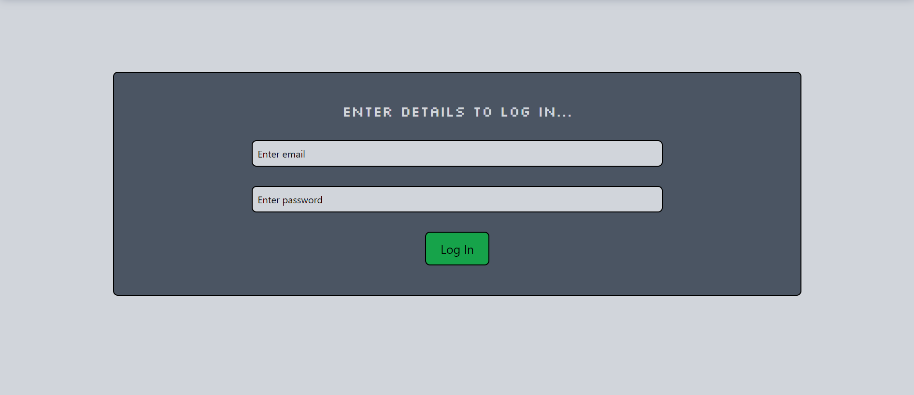
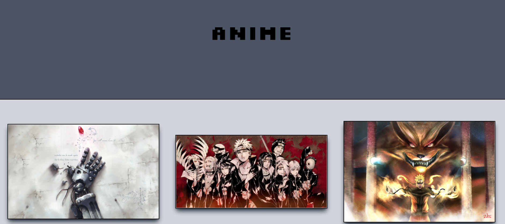

# Posterize

## Description
This application allows users to buy posters online. These posters will have different designs and will be separated based on category. A Login/Signup functionality will be implemented with JWT user authentication. Users can add multiple posters to their cart and also save posters to their favourites if they’re logged in. The application will have a ‘Contact Us’ page to get into contact with customer support. An ‘About Us’ page and a ‘Shipping and Returns’ page will have more information for the user.

## Screenshots of Application

## Link to Deployed Application
https://morning-temple-26451.herokuapp.com/

